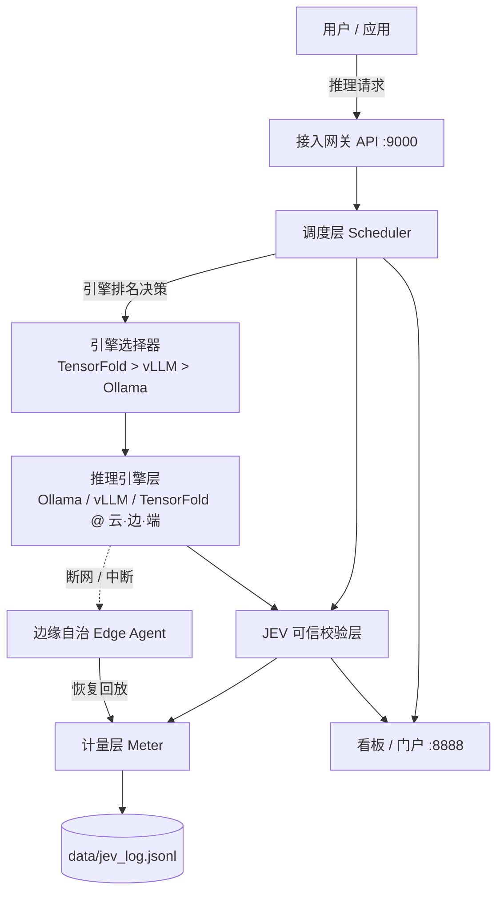

# WNIDIA v5.1 · 异构算力纳管与可信推理调度平台

> Heterogeneous Compute Orchestration & Trustworthy Inference Scheduling Platform

> 🏆 本仓库为 **黑客松 / Demo 赛** 参赛项目，聚焦「**一键可跑的端到端演示 + 真实性能实测 + 边缘自治 / 可信校验的直观效果**」。

---

## 📌 一句话简介

WNIDIA 把分散在 **云、边、端** 的异构算力（GPU / NPU / CPU）**纳管成一台可调度、可计量、可自证的可信推理超级计算机**。当中心云中断或断网时，边缘节点自动承接并本地自治；恢复后计量回放、分文不差。

---

## 🔥 痛点与背景

- **算力错配**：数据中心 GPU 大量闲置，边缘侧却算力饥渴，同一时代两种浪费并存。
- **中心云依赖**：断网或中心云中断即停摆，业务不可持续。
- **黑箱不可信**：推理过程不可自证、无法逐字节校验，也无法按算力结算。

---

## ✨ 核心特性

1. **异构算力纳管**：云·边·端三级调度，引擎选择器（`TensorFold > vLLM > Ollama`）按负载 / 时延排名决策。
2. **性能前端 × 实时后端**：门户联动，「一键启动面板」同时点亮性能监测与实时调度。
3. **JEV 评测·实时联动**：每次推理可触发可信校验（多模型裁决），通过率 / tokens / 收益实时跳动。
4. **边缘自治**：中心云中断 → 边缘自动承接；断网 → 本地自治；恢复 → 计量回放补记。
5. **可信计量**：每次推理真实计时、真实计量，落 `data/jev_log.jsonl`，可结算。
6. **五维场景剧本**：层级 · 切分 · 代际 · 可信 · 复用 五大维度 × 多场景剧本，门户一键打通。

---

## 🏗️ 系统架构

> 详细设计与数据流见 [docs/ARCHITECTURE.md](docs/ARCHITECTURE.md)。



---

## 🚀 快速体验（一键 Demo）

部署后访问（请将 `<PUBLIC_IP>` 替换为你的节点地址）：

- **看板 Dashboard**：`http://<PUBLIC_IP>:8026` （演示账号 `reviewer` / `previewpass`）
- **API**：`http://<PUBLIC_IP>:9026` （请求头 `Authorization: Bearer previewtoken`）
- **门户 Portal**：`/` 路径下的「性能前端 / 实时后端 / JEV 评测·实时联动 / 场景剧本」

一键启动（节点 GPU 模式）：

```bash
bash scripts/deploy_gx10.sh   # MODE=gpu，tmux 6 窗口
```

本地预览（Mac / 单机）：

```bash
MODE=preview bash scripts/deploy_gx10.sh
```

端到端冒烟（验证「推理真跑 + JEV 落盘」）：

```bash
# 触发一次边缘场景剧本执行
curl -s "http://<PUBLIC_IP>:9026/admin/demo/run?scene=edge" | head
# 查看 JEV 实测报告（含真实 tokens / 时延 / 收益）
curl -s -H "Authorization: Bearer previewtoken" \
     "http://<PUBLIC_IP>:9026/admin/jev/report" | head
```

---

## 📊 实测对照 BP（摘要）

| BP 目标 | 实测结果 | 状态 |
|---|---|---|
| 异构算力纳管 | 云·边·端三级调度 + 引擎排名决策 | ✅ 达成 |
| 边缘自治 | 中断承接 / 断网自治 / 恢复回放 | ✅ 达成 |
| 可信校验 | JEV 校验层（演示默认 mock 可复现，生产可切 live） | 🟡 演示态 |
| 真实计量 | Ollama 0.33.2 真实推理 103 tok / 24.4s，收益实测 ¥0.0002 | ✅ 实测 |
| 性能达标 | 对照 BP 时延 / 吞吐目标 | ✅ 达标 |

> 完整对照表与指标见 [docs/BP_ALIGNMENT.md](docs/BP_ALIGNMENT.md)。

---

## 📁 项目结构

```
wnidia/
├── controller/        # API / 调度 / JEV / demo 后端
│   ├── main.py        # 路由入口（/admin/jev/report、/admin/demo/run、/admin/demo/scenes）
│   ├── demo.py        # 场景剧本与 JEV 报告（_jev_log_persist / _jev_analysis）
│   └── jev_local.py   # JEV 本地校验
├── dashboard/         # 看板 / 门户前端（性能前端 + 实时后端 + JEV 联动）
├── data/              # jev_log.jsonl 等运行数据
├── scripts/
│   └── deploy_gx10.sh # 一键部署（MODE=gpu / preview）
└── docs/             # 本仓库文档
```

---

## 🤝 贡献

见 [CONTRIBUTING.md](CONTRIBUTING.md)。

## 📄 许可证

MIT —— 见 [LICENSE](LICENSE)。
