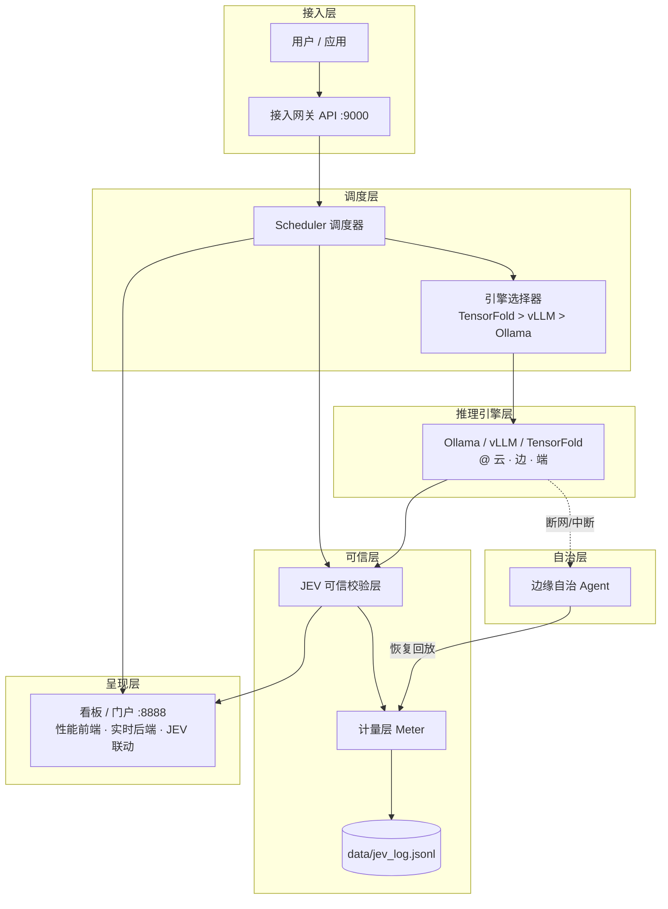

# 系统架构 · ARCHITECTURE

本文档说明 WNIDIA v5.1 的整体架构、关键组件、数据流与边缘自治机制，供技术评审与二次开发参考。

---

## 1. 分层架构

---

## 2. 关键组件

| 组件 | 职责 |
|---|---|
| **接入网关 (API :9000)** | 统一接收推理请求，鉴权（`Bearer previewtoken`），转发调度层 |
| **Scheduler 调度器** | 三级（云·边·端）算力感知与任务分发，含故障转移 |
| **引擎选择器** | 按负载 / 时延 / 代际对 `TensorFold > vLLM > Ollama` 排名决策 |
| **推理引擎层** | 真实推理执行（演示环境为 Ollama 0.33.2，GPU） |
| **JEV 可信校验层** | 对推理做一致性裁决；支持 `live`（多模型真实裁决）与 `mock`（可复现演示） |
| **计量层 Meter** | 真实计时 / 计量，落 `data/jev_log.jsonl`，可结算收益 |
| **边缘自治 Agent** | 中心云中断自动承接、断网本地自治、恢复后计量回放 |
| **看板 / 门户 (:8888)** | 性能前端 + 实时后端 + JEV 评测·实时联动 + 五维场景剧本 |

---

## 3. 端到端数据流

1. **请求接入**：`用户 → API :9000（鉴权）→ Scheduler`。
2. **调度决策**：Scheduler 调用引擎选择器，给出 `TensorFold > vLLM > Ollama` 排名，选最优落点（云 / 边 / 端）。
3. **推理执行**：引擎层真实推理，返回 token 与耗时。
4. **可信校验**：JEV 层对结果做一致性裁决（`mock` 默认；`live` 可切多模型裁决）。
5. **计量落盘**：Meter 真实计量，`_jev_log_persist` 写入 `jev_log.jsonl`，`_jev_analysis` 汇总指标（成功率 / tokens / 收益）。
6. **呈现**：看板实时刷新通过率 / tokens / 收益。

---

## 4. 边缘自治机制（核心创新）

- **中心云中断 → 边缘承接**：任务光点飞向中心云爆红中断时，调度器在瞬间自动改道，落入边缘算力箱续跑。
- **断网 → 本地自治**：断网图标浮现但任务不停，边缘 Agent 原地续跑，不依赖中心。
- **恢复 → 计量回放**：联网恢复刹那，金色批次光点回放补记，账本 `+¥` 结算，分文不差。

> 该机制在演示中已实测：中心云中断场景任务零中断完成，恢复后计量回放正确。

---

## 5. JEV 校验层：演示态 vs 生产态

| 模式 | 说明 | 当前默认 |
|---|---|---|
| `mock` | 校验占位、可复现，便于演示与评测一致 | ✅ 演示环境默认 |
| `live` | 真实多模型裁决（依赖 openJev 裁决服务 `:8201`） | 需显式开启 |

> **诚实说明**：当前演示环境默认 `mock` 以保证可复现与评审一致性；生产环境可通过 `WNIDIA_JEV_MODE=live` 切换真实多模型裁决（需部署 openJev 裁决服务）。架构与接口已就绪，切换无损。
