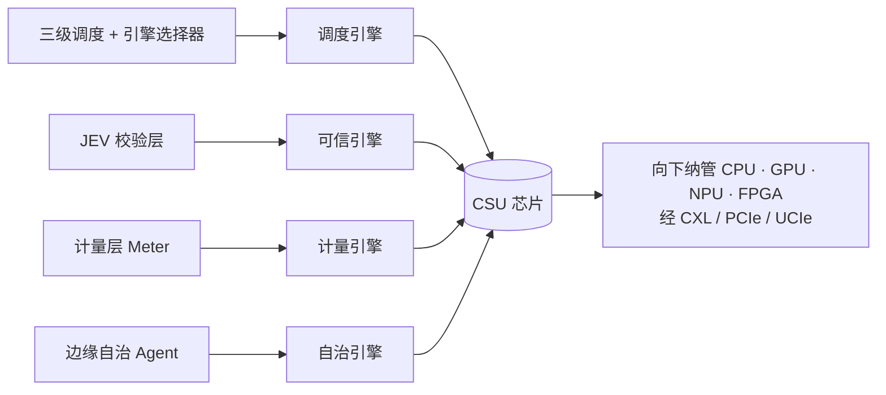

# WNIDIA CSU · 硬件愿景白皮书

> **CSU = Compute Scheduling & Settlement Unit（算力调度与结算单元）**
> 本文档把 WNIDIA 软件平台的能力映射为可硬化的芯片架构，作为 BP 的「第二曲线 / 长期硬件壁垒」章节。

---

## 一、CSU 是什么

**一句话定位**：主板上那颗「不管算、只管派活、背书和记账」的协处理器。
GPU / NPU 是干活的工人，**CSU 是调度员 + 公证员 + 会计，三合一**。

它只做三件事：

| 职能 | 对应软件层 | 作用 |
|---|---|---|
| **调度** | 三级调度 + 引擎选择器 | 把任务派给 CPU/GPU/NPU/FPGA 中最合适的那个 |
| **可信** | JEV 校验层 | 证明「哪个模型、哪份权重、什么输入、结果未被篡改」 |
| **结算** | 计量层 Meter | 防篡改地计量算力消耗，让算力能像电一样计费交易 |
| **自治** | 边缘自治 Agent | 离线续跑 + 恢复后回放结算 |

它**不做的**恰恰是关键：**它自己不推理、不产生 token**。所以它不是 NPU，也不是 GPU，而是**算力界的 DPU + TPM + 电表**。

**为什么需要它**：异构算力已成标配（CPU+GPU+NPU），但"谁该算、算得对不对、算了多少"全部由软件说了算——慢、有抖动、且可篡改。算力要交易、AI 要溯源，就必须有硬件级的中立裁判与计量根。

---

## 二、软件架构 → 硅片映射

| 软件能力 | 硬件模块 | 硬化后多出的价值 |
|---|---|---|
| 三级调度 + 引擎选择器 | **调度引擎** | 亚微秒级跨引擎路由、确定性 QoS（软件做不到） |
| JEV 校验层 | **可信引擎** | 不可篡改的证明（软件校验可被绕过） |
| 计量层 | **计量引擎** | 防篡改计费，算力可作数、可交易 |
| 边缘自治 | **自治引擎** | 非易失安全日志，离线算力事后可对账 |

---

## 三、四个模块详述

**调度引擎**：软件调度有延迟抖动，硬化后相当于一台「算力交换机」，可做亚微秒级路由与公平性保障。
**可信引擎**（最关键，也最难）：见第四节。
**计量引擎**：防篡改的按 token / 按瓦 / 按秒计量。**算力要能交易，就必须有块「电表」**——软件记账不可信，硬件计量才可作数。
**自治引擎**：非易失安全日志 + 断网续跑 + 恢复回放结算，让离线算力也能事后对账。

---

## 四、可信引擎的固化边界（核心判断）

**难点**：其他三块处理的是可测量的物理量（负载、时延、token、焦耳），而「可信」问的是*语义问题：这个结果对不对？*——没有标准答案、依赖会重训的外部裁决模型、且算法本身是移动靶。

**根本矛盾**：硬化换来防篡改，代价是不可升级；而可信判定恰好最需要升级。

**解法：把校验的「证明过程」固化，把「判断」留给固件。** 拆成三层：

| 层 | 内容 | 能否固化 |
|---|---|---|
| **L1 身份与完整性** | 哈希、签名、密钥不出片（PUF）、单调计数器 | ✅ 可固化（密码学标准稳定） |
| **L2 过程存证** | 证据链、时间戳、远程证明 | ✅ 可固化（确定性操作） |
| **L3 语义裁决** | 多模型一致性判定、通过阈值 | ❌ 不可固化（模型会重训、阈值会调） |

**该固化的（确定性、密码学、标准稳定）**：
- 密码学原语：SHA-3 哈希加速、HMAC、数字签名（ECDSA / 后量子）、PUF 密钥、单调计数器
- 证据链结构：`输入哈希 → 权重 commit → 输出哈希 → 裁决者身份 → 结论 → 时间戳`，链式签名
- 计量与裁决绑定：消耗与结论**一起签名**，防止「没校验的活也敢收费」
- 远程证明：外部可挑战芯片，取得签名证明

**绝不固化的**：裁决模型权重、参与裁决的模型名单、通过/失败阈值。

> **核心判断**：**硬件是公证处，不是法官。** 公证处不判断合同「聪不聪明」，只证明「你确实签了、何时签的、之后没改过」。TPM 同理——它不判断软件好不好，只度量并证明「启动了什么」。
> **硬件固化的是「过程不可篡改的证明」，不是「结论正确性的判断」。**

---

## 五、光 / 电路线选型

**结论：不是「光 CSU」，而是「电算 + 光连 + 光安全原语」的混合体。**

**为什么光计算不适合 CSU**：光计算的强项是线性代数（MVM 乘加），但 CSU 是控制面芯片，干的是分支判断、状态机、按位哈希、密钥存储、计数器——这些正是光的弱项（缺乏高效非线性、缺乏片上存储、难做分支与状态保持）。**把 CSU 做成光计算芯片等于用错工具，它的核心工作里没有矩阵乘法。**

**光在 CSU 上真正有价值的两个地方**：

1. **互连 I/O（工程价值最大）**：CSU 需同时扇出到多个算力单元并最好处在数据通路上。光 I/O / CPO 提供更高带宽密度、更低每比特功耗、抗 EMI；在机架级解构（CXL over optics）时优势显著。但近期 PCIe/CXL 电互连完全够用。
2. **安全原语（差异化最独特）**：
   - **光 PUF**：光穿过无序散射介质产生不可克隆响应，熵高、抗物理攻击，比电 SRAM PUF 更适合做「密钥不出片」的可信根
   - **光 / 量子 TRNG**：基于光子探测的真随机源，为密钥提供高质量熵
   - **防窃听**：光纤被窃听会引入可检测损耗，适合做计量证据链的安全通道

---

## 六、热管理评估

| 路线 | 功耗 | 热管理难度 | 说明 |
|---|---|---|---|
| **纯 CMOS CSU（推荐）** | 约 1–5W（BMC/TPM 量级） | **低** | 被动散热或借主板风道即可，多场景无需散热片；可放在主板任意位置，集成友好 |
| 引入光器件 | 显著上升 | **中 → 高** | 见下 |

**上光后热管理从「散热」变成「控温」**：
- **微环热漂移**：硅微环谐振波长漂移约 70–100 pm/°C，几度即失谐误码，需加热器 + 反馈**主动调谐**；调谐功耗常吃掉光互连省下的功耗
- **激光器控温**：效率随温度下降、寿命对温度极敏感，常需 TEC
- **CPO 热串扰**：激光器紧贴 CMOS 裸片，两者最佳温度不同
- **可靠性错配**：主板要 5–10 年寿命，激光器会老化——把「可信根」押在光源上是风险

对要求**确定性、防篡改、长寿命**的可信计量芯片，热漂移是负担而非加分。

---

## 七、竞品格局

| 玩家 | 已有能力 | 缺什么 |
|---|---|---|
| NVIDIA | MIG 切分、DCGM 监控、H100 机密计算 | 仅自家生态，不跨厂商，不做结算 |
| Intel | oneAPI 跨架构调度、TDX、IPU | 无算力计量结算 |
| AMD | ROCm、SEV-SNP 机密计算 | 同上 |
| Arm | SCMI 功耗管理、PSA 安全架构 | 不管任务调度与计量 |
| CXL 联盟 | 内存 / 算力池化互联 | 是通道，不是大脑 |
| 昇腾 / 寒武纪等 | 自家栈 + 可信计算 | 各家封闭，互不认账 |
| BMC 厂商（Aspeed） | 带外管理 | 完全不碰算力 |
| 算力交易平台（io.net / Render / Akash） | 软件计量 + 结算 | 计量可篡改——**正是 CSU 的机会** |

**结论**：没人做「跨厂商中立的可信计量根」，这是真空。但也正因为没人做，说明**需求尚未被验证**——这是最大不确定性。

---

## 八、商业化与融资路径

**不要走「自己造芯片卖」**：最大风险是被吸收——NVIDIA/Intel 完全可把计量与证明做进自家 GPU/BMC，CSU 就退化成「一个 feature 而不是一颗芯片」。

**更现实的路径：IP 核授权 + 软件栈**（Arm / Imagination 模式），把 CSU 做成可授权 IP 卖给 SoC / 主板厂。融资故事要讲 **design win**，不是讲愿景。

**RISC-V 是 CSU 的正确 ISA**：
- CSU 不需要高性能，需要**可定制指令**（哈希、调度决策）→ RISC-V 开放 ISA + 自定义扩展正合适
- 控制面 / 管理类芯片正是 RISC-V 渗透最快的赛道（Aspeed BMC 转 RISC-V、玄铁等）
- 避开 Arm / x86 授权成本

**VC 真实偏好排序（诚实）**：

| 方向 | VC 热度 | 现实 |
|---|---|---|
| AI 推理芯片（NPU） | 最热 | 红海，死掉一大批，无差异化难活 |
| **RISC-V 控制面 / 安全 / 管理芯片** | 稳、聪明钱 | 细分明确、ROI 清晰、客户具体 |
| **CSU（算力调度 + 计量）** | 太早 | 无 design win 前，VC 会说是愿景不是生意 |

**结论**：VC 今天更愿投「能马上卖出去的 RISC-V 控制/安全芯片」，而非「造一颗定义新类别的 CSU」。
正确顺序：**先把 CSU 做成软件平台 + IP 方案 → 拿下一个 design win → 再融资做硅片。**
反过来看，**WNIDIA 软件平台正是 CSU 最值钱的前置资产**——生态和软件栈才是壁垒，硅片本身不是。

---

## 九、路线图

1. **FPGA 原型**：验证调度逻辑 + 计量逻辑（不依赖裁决模型是否真实）
2. **Chiplet 小芯片**：挂 CXL / PCIe，作为可授权 IP
3. **试点**：与主板厂或云厂商 / 算力交易所合作，拿 design win
4. **推标准**：成为 CXL / UCIe 生态中的可选模块，而非另起炉灶

---

## 十、风险与诚实声明

- **JEV 当前为 mock**：真实多模型裁决服务未启用。可信引擎是四模块中最难硬化的，因为它依赖外部裁决模型——**硬件化之前必须先定义清楚「校验算法到底固化什么」**（见第四节）。
- **可能被大厂吸收**：CSU 有退化为 feature 而非独立芯片的风险。
- **需求尚未验证**：竞品空白既代表机会，也代表市场可能尚未成立。
- **本白皮书为愿景推演**，非已流片产品；所有性能与商业判断均为分析结论，非实测承诺。
